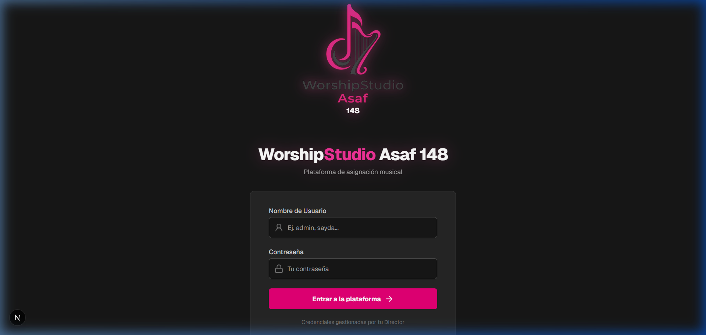
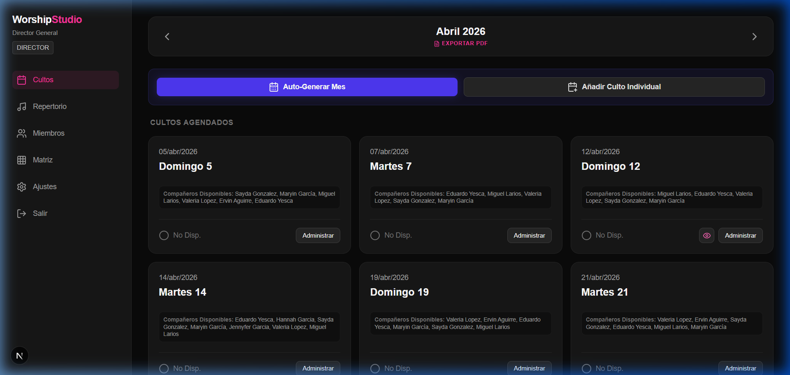
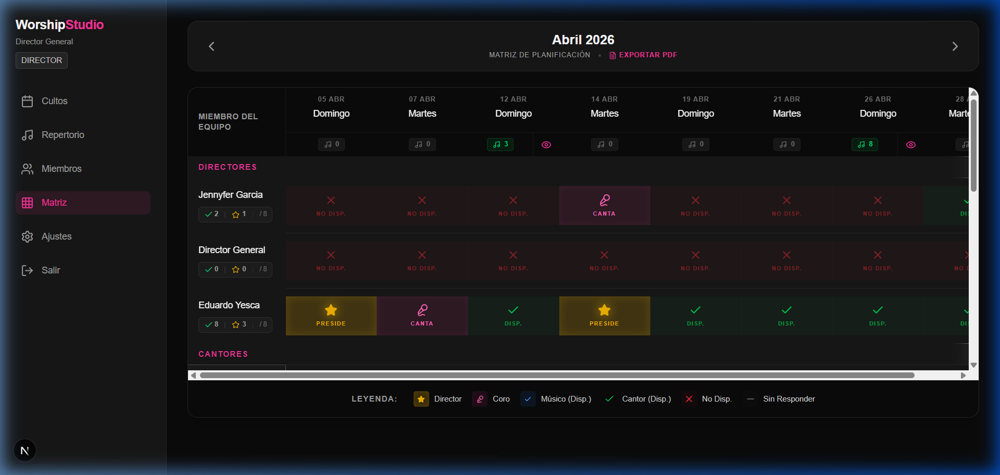
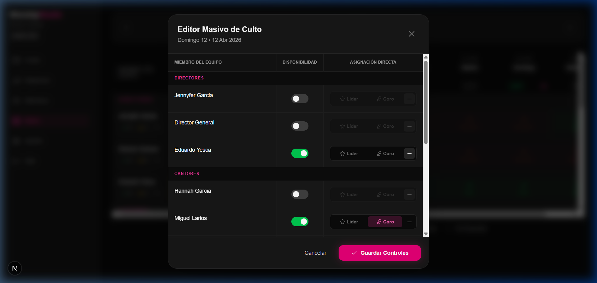
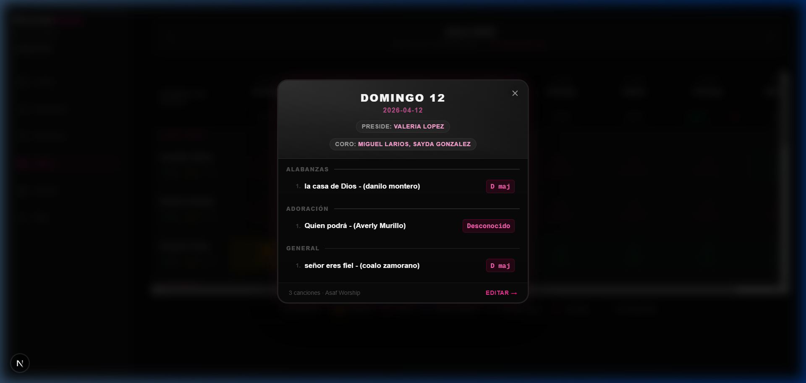

# 📖 Manual de Usuario: WorshipStudio Asaf 148

Bienvenido a la guía oficial de **WorshipStudio Asaf 148**, la plataforma definitiva para la gestión y planificación del ministerio de alabanza. Esta versión 2.0 incluye herramientas avanzadas de planificación masiva y una interfaz visualmente enriquecida.

---

## 🔐 1. Acceso y Seguridad

Para ingresar a la plataforma, utiliza las credenciales proporcionadas por tu Director General. 

> [!TIP]
> La nueva pantalla de inicio ahora cuenta con el logotipo oficial **Asaf 148** y está optimizada para dispositivos móviles.

---

## 👥 2. Roles y Permisos

| Rol | Descripción | Acciones Clave |
| :--- | :--- | :--- |
| **DIRECTOR** | Responsable General | Gestión de miembros, Matriz de Planificación, auto-generación de meses, **aprobación/rechazo** de setlists y gestión de biblioteca. |
| **CANTOR** | Líder de Alabanza | Marcar disponibilidad, armar setlists (solo si es asignado como Líder), asignar solistas y visualizar tonos vocales. |
| **MUSICO** | Apoyo Instrumental | Confirmar disponibilidad y estudiar bosquejos aprobados. |

---

## 🗓️ 3. Dashboard Central

El panel principal permite gestionar los cultos del mes y acceder rápidamente a la información sin navegar profundamente.

### Novedades en el Dashboard:
- **Vista Previa Rápida (Icono de Ojo)**: Permite abrir el setlist en una ventana emergente sin salir del dashboad.
- **Exportación Directa**: Botón **"Exportar PDF"** en la cabecera para descargar la planificación mensual en un solo clic.
- **Banners de Estado**: Ahora las tarjetas muestran claramente si un culto está "Pendiente de Aprobación" (Naranja) o si ha sido "Rechazado" (Rojo).

---

## 🔒 4. Flujo de Trabajo y Aprobación (Nuevo)

Para asegurar el orden y la calidad del repertorio, se ha implementado un flujo de aprobación riguroso:

1.  **Asignación de Líder**: Un Director DEBE asignar a un "Encargado" en la Matriz antes de que se puedan añadir canciones.
2.  **Armado (Borrador)**: El Líder asignado añade las canciones. Si el setlist fue rechazado previamente, verá un **Banner Rojo** con instrucciones.
3.  **Revisión**: El Líder envía el setlist a revisión. En este punto, el setlist se **bloquea** para el líder.
4.  **Aprobación/Rechazo**: El Director revisa. 
    - Si es **Aprobado**, se publica para todo el equipo.
    - Si es **Rechazado**, el Director pulsa "Solicitar Cambios", el setlist vuelve a estado Borrador y se desbloquea para que el Líder realice los ajustes necesarios.

> [!IMPORTANT]
> Los líderes no pueden editar setlists una vez enviados a revisión a menos que el Director los rechace o los devuelva a borrador manualmente.
---

## 📊 5. Matriz de Planificación (Solo Directores)

La **Matriz de Planificación** es la herramienta maestra para el Director General. Permite una vista panorámica de todo el mes, cruzando cultos con miembros del equipo.

- **Asignación Rápida**: Haz clic en cualquier celda para asignar roles de Líder o Coro.
- **Balance de Carga**: El sistema indica cuántos días ha servido cada persona para evitar sobrecargas.
- **Editor Masivo (Bulk Editor)**: Haz clic en la cabecera de cualquier fecha para abrir el panel lateral y configurar a todo el equipo en segundos.

---

## 🎶 6. Vista Previa de Setlist (Estilo WhatsApp)

Hemos rediseñado la vista previa para que sea legible, elegante y fácil de compartir con el equipo.

- **Efecto Glassmorphism**: El fondo se desenfoca para dar prioridad a la lista de canciones.
- **Detalles Técnicos**: Incluye el tono de la canción, el artista y quién es el solista asignado.

---

## 📚 7. Repertorio Inteligente

El módulo de **Repertorio** almacena el historial de todas las canciones usadas en la iglesia.
- **Cruce de Tonos**: Consulta qué tono le queda mejor a cada cantante.
- **Links de Ensayo**: Acceso directo a YouTube y búsqueda de acordes.

---

## 📤 8. Exportación y Reportes

Ahora puedes exportar la planificación en dos formatos desde múltiples puntos de la app:
1.  **PDF Estilizado**: Ideal para imprimir o compartir como documento oficial.
2.  **Excel (XLSX)**: Ideal para gestión administrativa clásica.

---

## ✨ 9. Buenas Prácticas

1.  **Confirmación Temprana**: Marca tu disponibilidad en los primeros días del mes.
2.  **Revisión de Tonos**: Asegúrate de que el tono en el setlist sea el correcto para el solista asignado.
3.  **Uso del Ojo**: Usa la vista previa rápida para consultas veloces durante los ensayos.

---

> [!IMPORTANT]
> Este manual está disponible en la raíz del proyecto tanto en formato **Markdown** (`.md`) como en **HTML** (`.html`) para su visualización en cualquier navegador.
